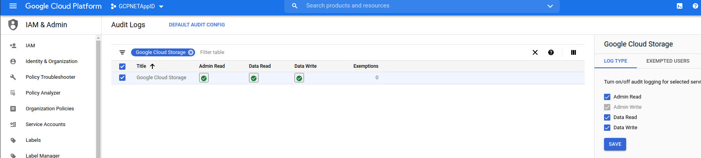
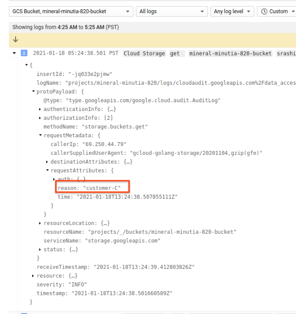
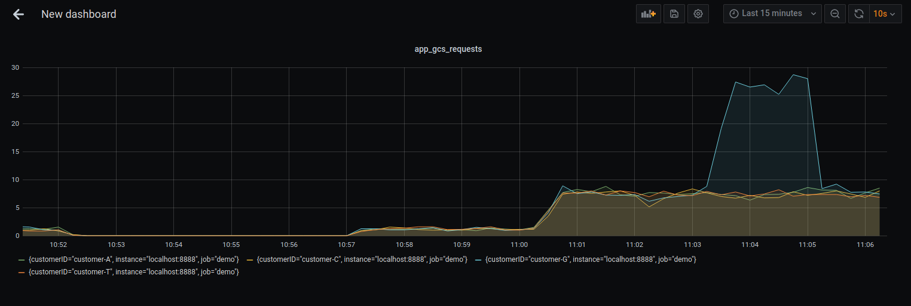

## Request Annotation with Cloud Audit Logging and Monitoring on GCP

Snippets demonstrating a simple way to embed/associate audit logged metadata to GCP API calls.  

Or in other words, whenever you make any  GCP API call like GCS, PubSub, you can automatically attach metadata to the call which will show up in audit logs.  One usecase is to attach information about why the request is being made.  For example, if you run a SaaS service that uses GCP APIs and you make calls to services on behalf of your customers, you can attach information to that call indicating who it was made for.

Also included in this repo is the basic 'helloworld' for OpenCensus.  With this, you can also emit a metric/counter to any exporter OpenCensus supports that indicates who the call is for.  Basically, you can have a metric that shows requests/second or any other metric per customer.


### Logging 


Sending optional metadata to any GCP API call is actually already there but just not advertized:
  
Simply send the metadata string with the hidden  `X-Goog-Request-Reason` header

  thats is.  Just use that header which isn't documented anywhere.

Infact, Cloud libraries, gcloud cli and even Terraform already supports that parameter

For gcloud its an environment variable or config value

```bash
$ export CLOUDSDK_CORE_REQUEST_REASON="fooo"
# or
$ gcloud config set core/request_reason foo

# then
$ gcloud secrets versions access 1 --secret="dbpassword"
```

for terraform, its just an env var (i'll file a feature request for terraform to get this in as a module parameter..)

```bash
$ export CLOUDSDK_CORE_REQUEST_REASON="fooo"
$ terraform apply
```

In golang, when you initialize the client, simply define [option.WithRequestReason()](https://godoc.org/google.golang.org/api/option#WithRequestReason):

```golang
	client, err := storage.NewClient(ctx, option.WithRequestReason(reason))
```

Since these entries show up in audit logs, first enable them:

Since the 


Once you send in the header, take a look at the structured payload data in the audit logs:



From there, you can even define [Log to Metrics](https://cloud.google.com/logging/docs/logs-based-metrics) as a counter value.

Or...if you just want to use curl:

```bash
curl -H "Authorization: Bearer `gcloud auth print-access-token`" -H "X-Goog-Request-Reason:  fooo" \
	  https://storage.googleapis.com/storage/v1/b/mineral-minutia-820-bucket
```

The protos defining this parameter is in
[audit_log.proto: RequestMetadata.request_attributes ](https://github.com/googleapis/googleapis/blob/master/google/cloud/audit/audit_log.proto)
  -->  [attribute_context.proto  Request.reason](https://github.com/googleapis/googleapis/blob/master/google/rpc/context/attribute_context.proto#L198)


One thing to point out is each client you initialize will reuse the _same_ reason.  Meaning, if you initialize a client, set the reason and then use the client for N API calls for different customer, they will all be attached to the same reason.  You can override per rpc but its a bit awkward to setup.  The following is one implementation for PubSub using gRPC: [per RPC Request Reason](https://gist.github.com/salrashid123/a26e5d5bec4a5522f4dde8bcbaeb0e80)


### Monitoring

Similar to logging events per customer, a SaaS provider may also want to emit metrics per customer.  In the following trivial sample, we will emit a counter simulating a customer request handled and then render the data using prometheus and Grafana.

The snippet is nothing new, its just the 'helloworld' of [Opencensus](https://opencensus.io/guides/grpc/go/).

Code provided in `monitoring/main.go` will run numerous go routines for all customers and then 3minutes in, a spike in a single customer requests.

To use

Start prometheus and grafana:

```bash
docker run \
    --net=host \
    -p 9090:9090 \
    -v `pwd`/prometheus.yml:/etc/prometheus/prometheus.yml \
    prom/prometheus


docker run --net=host -p 3000:3000 grafana/grafana 
```

Launch the Grafana console, (default username/password is `admin/admin`).

Configure grafana for a prometheus datasource

goto

```
 http://localhost:3000  admin/admin
 configuration=>datasources
   Select `Prometheus`
    Name: `envoy`
    URL: `http://localhost:9090/`
```

then graph the metric `apps_gcs_requests` using `rate()`:

Note tht there was a sudden spike in requests sent in by `customer-G`



---

also see 

[gRPC per method observability with envoy, Istio, OpenCensus and GKE](https://github.com/salrashid123/grpc_stats_envoy_istio)
